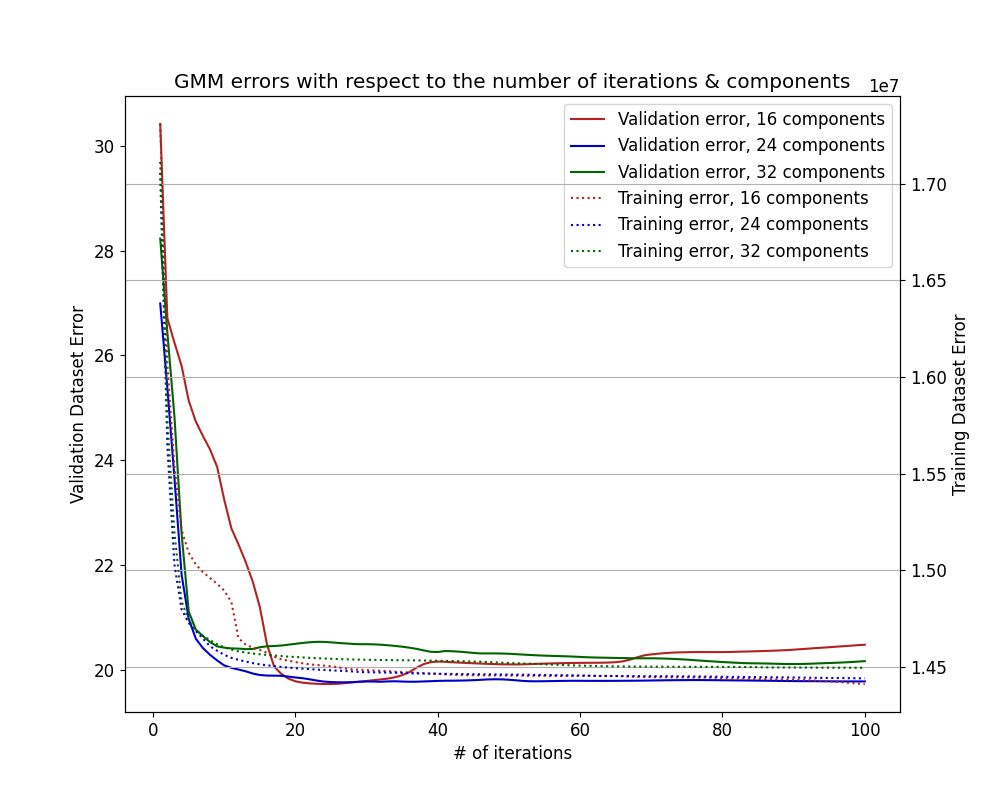
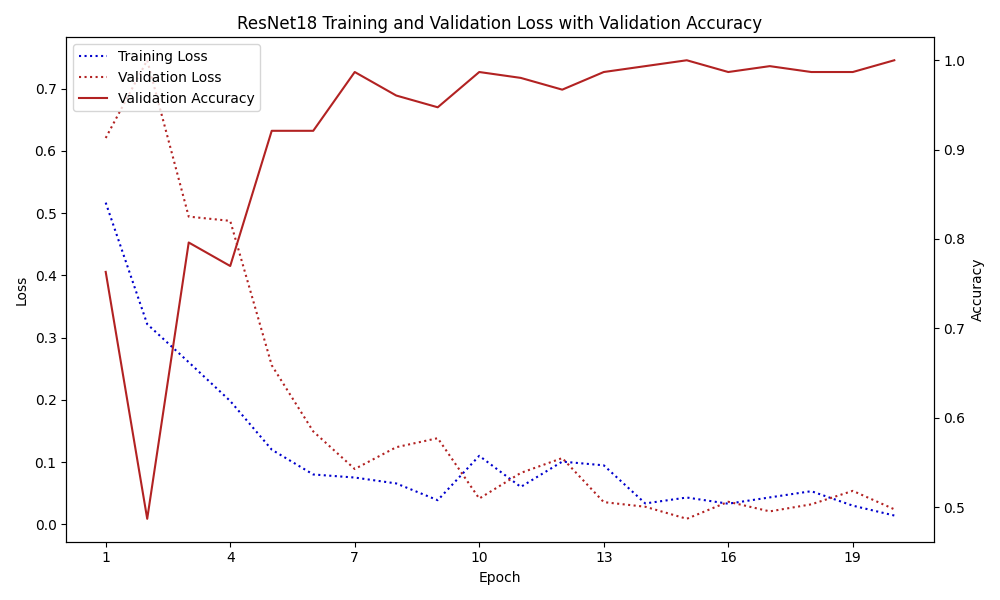

# People identification (SUR class project)

People identification based on voice recordings and headshot images.

*Featuring:* Gaussian Mixture Model (GMM) & ResNet-18.

*Authors*: David Chocholatý (xchoch09), Milan Tichavský (xticha09)

## Development setup

To install the required dependencies, run the following command:

```sh
make venv
```

Then, download the training dataset [from URL](https://www.fit.vutbr.cz/study/courses/SUR/public/projekt_2023-2024/) and
extract it into `data/` directory.

If you want to use audio augmentation, download [Room Impulse Response and Noise Database](https://www.openslr.org/28/)
and extract it into `RIRS_NOISES/` directory.

## Usage

To train and evaluate Gaussian Mixture Model (GMM) for speaker recognition, run the following commands:

```sh
# Train your model and save it into gmm_model.npz file
# The parameters for training can be tuned from within the script
python audio/gmm.py train gmm_model.npz

# Use your model to classify data on final dataset located in evaluation_dataset/eval
# WARNING: never load models from untrusted sources, loading of the model is not secure
# against erroneous or maliciously constructed data (uses pickle.load under the hood)
python audio/gmm.py classify models/gmm_audio_24_27.npz evaluation_dataset/eval \
  > results/gmm_audio_24_27.txt
```

To train and evaluate the ResNet18 model for the person recognition, run the following commands:

```sh
# Train the model
python images_resnet/train_resnet.py --dataset /path/to/the/dataset/dir/

# Use the model to classify data
python images_resnet/eval_resnet.py --model /path/to/models/model_checkpoint.pt \
  --dataset /path/to/the/dataset/dir/

# Plot statistics
python3 images_resnet/plotting.py
```

To train the combined model weights (probability or prediction version) and evaluate the combined model using the GMM and ResNet18 evaluations, run the following commands:
```sh
# Train the weights using the prediction version.
python utils/train_models_weights_pred.py --gt /path/to/groundtruth/file --gmm \
  /path/to/gmm/evaluations/file --resnet \
  /path/to/resnet/evaluations/file

# Train the weights using the probability version.
python utils/train_models_weights_pred.py --gt /path/to/groundtruth/file --gmm \
  /path/to/gmm/evaluations/file --resnet \
  /path/to/resnet/evaluations/file

# Evaluate the combined model using the weights (for example 0.6 for GMM and 0.4 for ResNet18).
python3 utils/eval_combined_model.py --gmm \
  /path/to/gmm/evaluations/file --resnet \
  /path/to/resnet/evaluations/file --gmm_weight 0.6 --resnet_weight 0.4
```

To generate the final report, install `pandoc` and `latex` and execute

```shell
pandoc README.md --metadata-file doc/pandoc-metadata.yml -s -o \
  doc/dokumentace.pdf
```

## Audio model

For audio, Gaussian Mixture Model (GMM) was used. The model was trained on the dataset provided by the course. 
The data was augmented by changing speed, adding Gaussian noise, adding room impulse response, and adding different 
background noises (using the Room Impulse Response and Noise database mentioned above).

Evaluation of the GMM models during training was performed using `audio/peekin.py` and `audio/plotting.py` helper 
scripts. During training, we were watching the sum of total log likelihoods for both target and non-target classes. 
For validation, we were looking at the sum of differences from the expected probabilities on all data samples.

See the following figure for performance of the GMM models on test and validation datasets with respect to the number of 
components and iterations used. We used only clear data for evaluation (without any augmentation).



Note that the means of the Gaussian components are initialized stochastically from the training samples,
so the results may vary between runs. Also, for target class, there is only 10 training samples, so when choosing more
components, they may not be fully utilized. However, we have way more samples for non-target class, that's why we're
okay with initializing both mixtures with more components than 10 (to simplify development).

For our runs, clearly the most performant and the best converging models are those with 24 components. The model 
we selected for further use is located at `models/gmm_audio_24_27.npz` (24 components, 27 iterations).

## Image training model

For images, the ResNet18 model was used. The model was trained using the split of the training and validation dataset. The data was augmented using dynamic On-the-Fly augmentation with an augmentation probability of 0.8. The validation loss and accuracy were calculated using the augmented validation data too. The final evaluation was made on clean examples (without any augmentation). The augmented techniques were used such as blurring, changing contrast or saturation, flipping, etc.

The final model uses the Early Stopping method for choosing the best model. The saved model was trained for ```15``` of ```20``` epochs in total. The chosen hyperparameters were set: ```batch_size=32```, ```learning_rate=0.0001```. With that, the Adam optimizer was used including L2 regularization with the ```weight_decay``` parameter set as ```1e-5```.


See the following figure for the performance of the ResNet18 model (train and validation loss and validation accuracy).



The model we selected for further use is located at `models/resnet_image_15_20.pt` (saved at 15 epochs of 20 epochs
totally) chosen using the Early Stopping approach.

The following table captures the list of best performance models that have been tried.

| Model | Epochs | Learning Rate | Batch Size | Random Augmentation | Augmentation Probability| K-Folds | Early Stopping (Epochs saved) | StepLR Scheduler (Step Size, Gamma) | Validation Accuracy |
| --- | --- | --- | --- | --- | --- | --- | --- | --- | --- |
| ResNet18 | 20 | 0.001 | 32 | &cross; | 0.0 | &check; | &cross; | &cross; | 0.9 |
| ResNet18 | 20 | 0.0001 | 32 | &check; | 0.8 | &cross; | &cross; | &cross; | 0.9143 |
| ResNet18 | 20 | 0.001 | 32 | &check; | 0.8 | &check; | &cross; | &cross; | 0.8714 |
| ResNet18 | 20 | 0.0001 | 32 | &check; | 0.8 | &check; | &cross; | &cross; | 0.8714 |
| ResNet18 | 20 | 0.0001 | 32 | &check; | 0.6 | &cross; | &cross; | &cross; | 0.9286 |
| ResNet18 | 20 | 0.0001 | 16 | &check; | 0.8 | &cross; | &cross; | &cross; | 0.8571 |
| ResNet18 | 20 | 0.0001 | 32 | &check; | 0.8 | &cross; | &check; (15/20) | &cross; | **0.9857** |
| ResNet18 | 20 | 0.0001 | 32 | &check; | 0.6 | &cross; | &check; (17/20) | &cross; | 0.8857 |
| ResNet18 | 20 | 0.0001 | 32 | &check; | 0.8 | &cross; | &check; (16/20) | &check; (5, 0.1) | 0.9000 |
| ResNet18 | 20 | 0.001 | 32 | &check; | 0.8 | &cross; | &check; (14/20) | &check; (5, 0.5) | 0.8143 |
| ResNet18 | 10 | 0.0001 | 32 | &check; | 0.8 | &cross; | &check; (10/10) | &cross; | 0.8714 |
| ResNet18 | 30 | 0.0001 | 32 | &check; | 0.8 | &cross; | &check; (24/30) | &cross; | 0.8714 |

- *Random Augmentation* denotes dynamic On-the-Fly Augmentation.
- *K-Folds* denotes the cross-validation approach tried.
- *Early Stopping* - the saved epochs means in which epoch the final model was saved.

To improve the image model performance of the larger dataset the deeper and larger ResNet model should be used (such as ResNet50, etc.). Of course, a wider range of augmentation techniques could be used.

## Combined model
The combined model uses both systems for audio (GMM) and images (ResNet18). The combination of the models can be obtained using the three approaches. All of these approaches calculate the final probability as follows:

$P_{COMB} = w_{GMM} * P_{GMM} + w_{RESNET} * P_{RESNET}$

The evaluation script is saved in ```utils/eval_combined_model.py```.

### Even distribution
The weights for probabilities of models are chosen as $w_{GMM} = w_{RESNET} = 0.5$.

### Weights training using predictions

The code is saved in the ```utils/train_models_weights_pred.py``` file and the weights are calculated using the addition rewards, if some of the models are correct and the others are not such that if one model is completely right and the other wrong, the first model weight would be one and the others zero. The training was made using the development dataset part to calculate the weight using the unseen data.

### Weights training using probabilities

The code is saved in the ```utils/train_models_weights_prob.py``` file. The weights are obtained using the probability system with rewards and penalties. The two systems are evaluated independently such that if the system is correct, it gets a reward for how much the prediction was far from the 0.5 threshold. If wrong, the same range is the penalty. The two trained models are finally recalculated such that the sum of weights is one. The training was made using the development dataset part to calculate the weight using the unseen data.

For the final evaluation, the even distribution model was chosen and two other models were used using the second weights calculation approach (using the probabilities). One forward model was chosen ($w_{RESNET} = 0.66$ and $w_{GMM} = 0.33$ approximately), and one which used the calculated weights conversely ($w_{RESNET} = 0.33$ and $w_{GMM} = 0.66$ approximately).

To improve the combined model performance, outside of sub-model improvements, advanced training techniques for weights could be used. With that, the larger dataset for weight training should be used (we used the development dataset of about 50 examples).

## Results
The project documentation is located in ```doc/dokumentace.pdf```.

The results evaluations containing the five systems are located in ```results/``` folder. The files contain the following systems:

| System                     | Description |
| ---                        | ---         |
| gmm_audio_24_27.txt        | The system which uses only the GMM audio model.      |
| resnet_image_15_20.txt     | The system which uses only the ResNet18 image model. |
| gmm_resnet_0_5.txt         | The system uses both models. The weight for both model's probabilities is 0.5. |
| gmm_resnet_0_66_gmm.txt    | The system uses both models. GMM probability weight: 0.6618765075622808, ResNet18 probability weight: 0.3381234924377192. |
| gmm_resnet_0_66_resnet.txt | The system uses both models. ResNet18 probability weight: 0.6618765075622808, GMM probability weight: 0.3381234924377192. |
